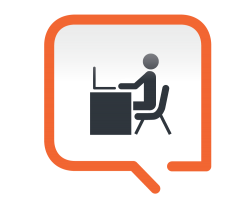
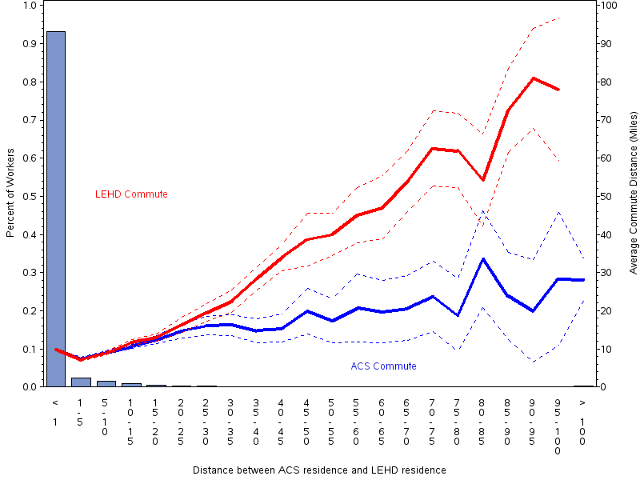

# Declining survey response rates

## An image worth many words

(source: the economist)

## Another statistic

(source: Pew)

# Administrative data 

## Administrative data can be very useful

- Universal coverage
- Comprehensive network data

## Evolution

## Admin data can be hard to access

- Onerous rules
- Administrative hassle

## Access

<figure>
<figcaption>pod</figcaption>
</figure>

## Hassles

### Security clearance

### Annual training

### Remote access key

### Cost

# Privacy and security are necessary

## Threats

### Reconstruction attacks are real

### Bad research practices are frequent

  - PII published through negligence
  - Unencrypted data on laptops stolen

# Privacy and security need not be an impediment

## The French network

<figure>
<figcaption>French network</figcaption>
</figure>

## Successful CASD

### 660 projects (January 2020)

### Pay-per-use, scalable infrastructure

### Accessible from multiple European countries, and from North America

## German network

<figure>
<figcaption>Forschungszentren des IAB</figcaption>
</figure>

## Features of the German network

### Multiple physical access points in North America and Europe

### Web-access possible

## Other examples

- Danish data (hostage-holding)
- US Government personnel (remote access when highly trusted)

# Non-survey data are  also imperfect

## Administrative data

### Response rates are high

### But measure only certain things

## "Found data"

### On the internet, everybody is xx years old

### Representativeness/ reliability of one (internet) company's data

## Compare income

| Admin data | vs | Survey data |
|------------|----|-------------|
| Formal wages| |Formal and informal    wages|
| Profit/Income from SE | |Hours spent on SE |
| Reporting location | |(One of) actual locations |
| Receipt of support income | | Memory of receipt of support income |
| Purchase of product | |Consumption of product |
| Indicators of poverty | | Perception of poverty |
| Occupation recorded | |Tasks performed |

## Self-employment incidence

](images/abraham-gig-economy-2017-figure1.png)

## Self-employment mis-measurement

](images/abraham-gig-economy-2017-figure2b.png)

See also [Meyer and Mittag (2019)](http://doi.org/10.1257/app.20170478)

# Compare locations

My co-authors and I compared administrative job locations with survey job locations

## Differences in residence location

## Differences in work locations

# Looking forward

***

## Easier but secure access to richer data

###  Access should be made easier 

- technology/training/legal framework is available

### Silos need to be broken down

- combine data from private/gov't/provincial sectors (not just "big" data)

### Researchers **and** providers need to be trained 

- on new access methods, new protection methods, stronger ethics

## New ways of collecting data

### Consider co-designing surveys and admin data

- better data
- for novel data

](images/bit-logo.png)
](images/iiu-canada.png)
](images/oes-usa.png)

## More secure ways to collect

- Differential privacy works for some collections
- Data ownership is the new oil - for individuals, too

# Thank you

